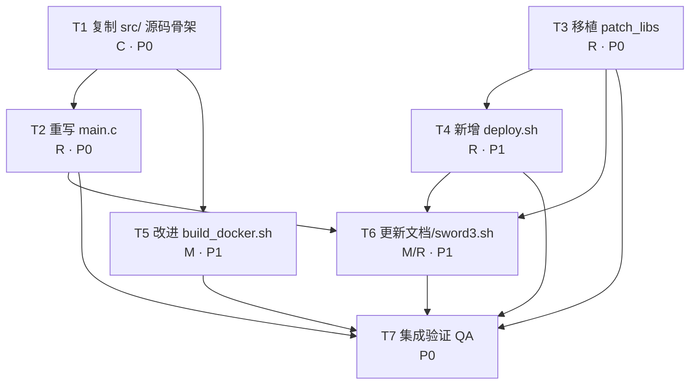

# 轩辕剑3天之痕 (Sword3 / `com.softstar.G.swd3e`) so-loader 重构设计方案

> 重构类型：**架构清理（architecture cleanup）** —— 保留运行时行为，重组 loader 内部（加载顺序更清晰、shim 拆分/注释更清楚），不做完全重写。
> 作者：架构师 高见远 ｜ 日期：2026-07-31
> 基线源码：`E:\Programs\nextos-my-ports\ports\sword3`（src/ + build_docker.sh + sword3.sh + docs/）
> 落地目标：`E:\Programs\NextOs-Ports\sword3`（当前为空目录）

---

## 0. 设计目标与硬约束

### 0.1 用户锁定的三条决策
1. **重构深度 = 架构清理**：保留运行时行为，重组 loader 内部（加载顺序更清晰、shim 拆分/注释更清楚），不做完全重写。
2. **交付范围 = loader + 构建 + 部署 + 文档**：产出 `src/` + `build_docker.sh` + 部署期 patch 脚本 + 更新 `README.md` / `sword3.sh`，落盘到 `E:\Programs\NextOs-Ports\sword3`。
3. **SDL2_image 策略 = 随包 + patch_libs**：`main.c` 改回加载随包 `libSDL2_image.so`（去掉硬编码设备路径），部署期用 patch 脚本把全部 Android `.so` 的 `LIBC` 标 `WEAK`。

### 0.2 两个实机根因 bug（已实证）
| # | 根因 | 现象 | 解法 |
|---|------|------|------|
| Bug A | `main.c` 的 `SECONDARY_SOS[]` 硬编码 `"/usr/lib/libSDL2_image-2.0.so.0"`（设备 glibc 版），顶替随包 Android 版 → `IMG_Load` 全程返回 nil（PNG 解码失败） | 实机黑屏（注释误以为这是"修 PNG 不支持"的对策，实则错误） | 改回加载随包 `libSDL2_image.so` |
| Bug B | 所有 Android `.so`（含 libSDL2_image.so / libc++_shared.so 等）在 `.gnu.version_r` 把 libc/libm 标成 bionic 的 `LIBC` 版本节点，glibc 设备没有 → `dlopen` 直接失败（`undefined symbol: free, version LIBC`） | 启动即崩 | 部署期把所有 Android `.so` 的 `LIBC` 标 `WEAK`（已有 `patch_libs.py` 工具） |

### 0.3 库分类硬约束（docker 镜像实测 soname 反证）
- **可改用设备文件（不随包）**：`libGLESv2` / `libGLESv1_CM` / `libEGL`（loader 按裸 soname 预载设备 Mali 驱动）、`libc` / `libm` / `libdl`（设备 glibc，须 `LIBC→WEAK` 才能 dlopen）、`libz`（设备 `libz.so.1`，ABI 稳定）。
- **必须随包（不可顶替）**：`libSWD3E.so`、`libSDL2.so`、`libSDL2_image.so`、`libSDL2_mixer.so`、`libSDL2_ttf.so`、`libsmpeg2.so`、`libmpg123.so`、`libhidapi.so`、`libc++_shared.so`（NDK r20 LLVM，镜像无）。
- **关键**：游戏侧 SDL2 全家桶是**裸 soname**（`libSDL2.so` 等），设备/镜像是**带版本 soname**（`libSDL2-2.0.so.0`）→ 不匹配，所以必须随包并防设备版被 `ld.so` 经软链误抓。

> 需要 `LIBC→WEAK` 标记的 Android `.so` 完整白名单（部署期 patch 作用对象）：
> `libSWD3E.so` / `libSDL2.so` / `libSDL2_image.so` / `libSDL2_mixer.so` / `libSDL2_ttf.so` / `libsmpeg2.so` / `libmpg123.so` / `libhidapi.so` / `libc++_shared.so`
> （`libbionic_shim.so` / `liblog.so` 由我们在 glibc 下编译，无 `LIBC` verneed，无需 patch。）

---

## 1. 目标目录文件结构

```
NextOs-Ports/sword3/                      # 交付根（= 未来 $GAMEDIR 的源码侧）
├── build_docker.sh          # [小改] aarch64 交叉编译；链接命令不变，补注释 + 加 liblog.so 构建
├── deploy.sh                # [新建] 编排：build → patch 暂存目录 → 给出推送指引
├── sword3.sh                # [更新] 启动脚本（前台、单实例、中文 locale、SUMMERTIME_CURSOR=0）
├── README.md                # [更新] 数据布局（随包/设备）、启动流程、patch 步骤、已知项
├── docs/
│   ├── REFACTOR_DESIGN.md   # 本文件（规划产物，非运行时交付）
│   ├── HANDOFF.md           # [更新] 技术交接（符号核对、编译修复、运行期架构）
│   └── PROGRESS.md          # [携带] 进度记录（原样/小补）
├── src/                     # [原样复制 + main.c 重点重写]
│   ├── main.c               # [重点重写] 库加载编排拆分；修复 SECONDARY_SOS（SDL2_image）
│   ├── egl_shim.c / egl_shim.h
│   ├── imports.c / imports.h
│   ├── jni_shim.c / jni_shim.h
│   ├── opensles_shim.c / opensles_shim.h
│   ├── android_shim.c / android_shim.h
│   ├── etc1.c / etc1.h
│   ├── so_util.c / so_util.h
│   ├── util.c / util.h
│   ├── libbionic_shim.c
│   ├── libbionic_shim.vers   # version-script：导出 __sF@LIBC + Android_JNI_*
│   ├── error.c / error.h
│   ├── hashmap.h
│   └── _unused_katanazero/   # [携带] 误用脚手架反例（git-ignored，保留参考）
├── stubs/
│   └── liblog_stub.c         # [原样] Android liblog.so 最小替身源码
└── tools/
    ├── patch_libs.py         # [新建/移植] ELF LIBC→WEAK 补丁（含 --verify、目录递归、白名单）
    └── patch_libs.sh         # [新建] 薄包装：定位 python3 后调 patch_libs.py
```

文件状态图例：**重点重写** = `main.c`、`tools/patch_libs.py`、`tools/patch_libs.sh`、`deploy.sh`、`README.md`、`sword3.sh`；**小改/补注释** = `build_docker.sh`、`docs/HANDOFF.md`；**原样复制** = `src/` 其余 `.c/.h`、`stubs/liblog_stub.c`、`docs/PROGRESS.md`、`src/_unused_katanazero/`。

---

## 2. main.c 重构设计

### 2.1 函数拆分（把"库加载编排"重构成清晰函数）

保留现有辅助函数（`install_crash_handler`、`sw_kill_prior_instances`、`sw_cpu_performance`、`sw_dir`、`sw_hook_game_func`），**新增/抽取**以下编排函数，使 `main()` 成为清晰的 4 步流水线：

```c
/* 步骤1：设备侧 SDL2 窗口初始化（egl_shim 自动选后端，绝不设 SDL_VIDEODRIVER） */
static void setup_device_sdl_video(void);

/* 步骤2a：把游戏自带 secondary .so 以 RTLD_GLOBAL 预载入全局符号域
 *         （供 libSWD3E.so 解析 SDL_*/Mix_*/TTF_*/IMG_*/SMPEG_*）
 * 顺序由 SECONDARY_SOS[] 决定；libbionic_shim.so/liblog.so 必须在 libc++_shared.so 之前。
 * 关键前置（部署期）：所有 Android .so 须已 LIBC→WEAK（见 2.3）。 */
static void load_secondary_libs(const char *basedir);

/* 步骤2b：把设备 Mali 驱动（裸 soname）拉入全局域，供 so_resolve 的 dlsym 回退 */
static void load_device_gles(void);

/* 步骤3+4：so_load → so_relocate → so_resolve → hook → JNI → SDL_main
 *         （保持现有逻辑，仅抽成 setup_and_run_game() 提高可读性，可选） */
```

> `main()` 阅读顺序变为：`install_crash_handler` → `sw_kill_prior_instances` → `sw_cpu_performance` → `setup_device_sdl_video` → `load_secondary_libs` → `load_device_gles` → 主模块加载与 hook → JNI/SDL_main。逻辑与现有行为逐字节等价，仅结构更清晰。

### 2.2 SECONDARY_SOS 新顺序与内容（修复 SDL2_image 那一项）

| 下标 | 原值（错误） | 新值（修复后） | 说明 |
|------|--------------|----------------|------|
| 0 | `libbionic_shim.so` | `libbionic_shim.so` | 导出 `__sF@LIBC` + `Android_JNI_*`，必须第一 |
| 1 | `liblog.so` | `liblog.so` | liblog 桩，必须第二 |
| 2 | `libc++_shared.so` | `libc++_shared.so` | NDK r20 LLVM；**须排在 libbionic_shim/liblog 之后**（见下注） |
| 3 | `libSDL2.so` | `libSDL2.so` | 游戏自带 Android SDL2（裸 soname），内含 EGL→egl_shim→原生SDL2、GLES→设备Mali 桥接 |
| 4 | `/usr/lib/libSDL2_image-2.0.so.0` ❌ | `libSDL2_image.so` ✅ | **修复点**：改回随包 Android 版；设备版 `IMG_Load` 解码失败→黑屏 |
| 5 | `libSDL2_mixer.so` | `libSDL2_mixer.so` | 不变 |
| 6 | `libSDL2_ttf.so` | `libSDL2_ttf.so` | 不变 |
| 7 | `libsmpeg2.so` | `libsmpeg2.so` | 不变 |
| 8 | `libhidapi.so` | `libhidapi.so` | 不变 |
| 9 | `NULL` | `NULL` | 终止符 |

**顺序铁律（保留原注释并强化）**：`libbionic_shim.so` / `liblog.so` **必须**排在 `libc++_shared.so` 之前 —— `libc++_shared` 的 `std::cout/cerr` 静态初始化在自身 `dlopen(RTLD_NOW)` 时就解析 `&__sF[1]`，缺则整个 C++ 运行时加载失败，连累 `libsmpeg2`/`libhidapi`（它们 NEEDED `libc++_shared`）一并失败。

> 加载方式保持不变：先试 `{basedir}/{name}` 绝对路径，再试裸名（靠 `LD_LIBRARY_PATH`）；失败仅打 `[warn]` 非致命日志（保留原行为，便于现场排错）。但 `libSDL2_image.so` 失败会导致黑屏，故 `load_secondary_libs` 对该项单独打**高亮警告**日志。

### 2.3 LIBC→WEAK 调用点说明（main.c 不执行 patch）

`apply_libc_weak_patch()` **不在 main.c 运行时执行**——它是**部署期前置条件**。在 `load_secondary_libs()` 顶部加如下注释块说明调用点契约：

```
/* 部署期契约（非运行时）：
 * 本函数假定 SECONDARY_SOS 中所有 Android .so 已在部署期经
 *   tools/patch_libs.sh $GAMEDIR
 * 把 .gnu.version_r 的 "LIBC" verneed 标为 WEAK（VER_FLG_WEAK）。
 * 若漏跑该 patch，glibc ld.so 会报
 *   "undefined symbol: free, version LIBC" / "version `LIBC' not found"
 * 并拒绝 dlopen。见 deploy.sh / tools/patch_libs.sh 与 README 的 patch 步骤。
 * main.c 自身不做 ELF 改写。 */
```

> 同时修正原 `main.c` 第 177–181 行**误导性注释**：原注释称"用设备侧 SDL2 顶替游戏自带 Android libSDL2.so（同目录建 libSDL2.so → /usr/lib/libSDL2-2.0.so.0 同名符号链接）"。这与 0.3 硬约束（libSDL2.so 必须随包）和 HANDOFF 结论（游戏内 Android libSDL2.so 承担 EGL→egl_shim→原生SDL2、GLES→设备Mali 桥接）冲突。**修正为**：随包 Android `libSDL2.so` 原样加载（裸 soname，不与设备版冲突）；设备 `libSDL2-2.0.so.0` 仅在**链接期**进入 loader 二进制用于 `egl_shim_create_window` 窗口化，不进入游戏 secondary 集合。运行时行为不变（SECONDARY_SOS[3] 仍是 `"libSDL2.so"`），仅澄清注释。**（见 §8 未决项）**

### 2.4 注释/日志改进点
- `main()` 顶部文件头注释已较完整，保留并补一句："SDL2_image 必须用随包 Android 版 + 部署期 LIBC→WEAK，禁用设备 libSDL2_image-2.0.so.0"。
- `load_secondary_libs` 每次成功打印 `loaded secondary: <name>`；对 `libSDL2_image.so` 额外打印 `  [ok] SDL2_image = bundled libSDL2_image.so (LIBC->WEAK patched at deploy)`，使修复可审计。
- 在 `main()` 启动横幅中加一行标识本构建已采用"随包 SDL2_image + 部署 patch"策略，便于现场日志核对（如 `[build] SDL2_image=bundled, LIBC-patch=deploy-time`）。
- 统一日志前缀风格（现有 `debugPrintf` 已用 `[hook]`/`[warn]`/`loaded secondary`，保持一致即可）。

### 2.5 待澄清 / 假设
- 假设 1：`libSDL2.so` 来源策略**维持现状**（随包裸 soname），本重构不改动其加载方式，仅纠正注释。
- 假设 2：原 `main.c` 的 `dev_libm`/设备 `libz` 等不进入 SECONDARY_SOS（它们走 `LD_LIBRARY_PATH`/默认域），保持现状。

---

## 3. 部署期 patch 脚本设计

### 3.1 `tools/patch_libs.py`（从 `E:\Programs\nextos-my-ports\test\sword3\patch_libs.py` 移植增强）
- 保留核心逻辑：解析 ELF，定位 `.dynstr` + `.gnu.version_r`，把 `vna_name == "LIBC"` 的 `vna_flags` 置 `VER_FLG_WEAK(0x2)`，**原地修改、零位移、可逆、最安全**。
- 增强点（设计，不写实现）：
  - 支持**目录参数**：递归遍历目录下所有 `*.so`；支持多文件/多目录混传。
  - **白名单保护**：默认只对 §0.3 白名单内的 Android `.so` 打补丁，避免误改设备库；提供 `--all` 强制对任意含 `LIBC` verneed 的 ELF 打补丁。
  - **幂等**：已 `WEAK` 的跳过并打印 `already done`，不重复改写（原 `verify_file` 逻辑复用为 `--verify` 模式）。
  - 入口：`patch_libs.py [--verify] [--all] <file-or-dir> [...]`，`--verify` 仅检查不写盘，返回 0/非0 供 CI/部署脚本判断。
  - 兼容性：`import struct`，仅用标准库；支持 32/64 位 ELF（`is64 = data[4] == 2`）。

### 3.2 `tools/patch_libs.sh`（薄包装）
```bash
#!/usr/bin/env bash
# patch_libs.sh — 把 GAMEDIR/暂存目录下 Android .so 的 LIBC verneed 标 WEAK
# 用法: patch_libs.sh [--verify] [--all] <dir-or-.so> [<dir-or-.so> ...]
# 依赖: python3（或 python）；实际改写逻辑在 tools/patch_libs.py
set -euo pipefail
HERE="$(cd "$(dirname "$0")" && pwd)"
PY=$(command -v python3 || command -v python)
exec "$PY" "$HERE/patch_libs.py" "$@"
```
- 容错：找不到 python 时打印明确错误并 `exit 1`。

### 3.3 `deploy.sh`（根目录编排器，新建）
职责：**build → patch → staging → 指引推送**。设计（非实现）：
1. 调 `bash build_docker.sh` 产出 `sword3` + `libbionic_shim.so`（及新增的 `liblog.so`）。
2. 取暂存目录参数（默认 `./deploy`，或 `$1`）；若不存在则创建。
3. 拷贝交付物进暂存：`sword3`、`libbionic_shim.so`、`liblog.so`、`sword3.sh`、`README.md`。
4. 提示用户把**自备的游戏 Android `.so` + `assets/`** 放入同一暂存目录（BYO-data，不入库）。
5. 调 `bash tools/patch_libs.sh "$STAGING"` 把全部 Android `.so` 的 `LIBC` 标 `WEAK`。
6. 打印推送指引：`rsync/scp` 暂存目录 → 设备 `$GAMEDIR`（`/storage/roms/ports/sword3`）。
- 支持 `deploy.sh --verify` 仅做 patch 校验。

### 3.4 执行位置与时机
- **时机**：在 `build_docker.sh` 之后、**设备部署时**（游戏 `.so` 是 BYO-data，不在 docker 镜像内，故无法在构建期 patch）。
- **两种落地方式（均在文档说明）**：
  - 推荐：在**主机**上对"含游戏 `.so` 的暂存目录"跑 `deploy.sh <staging>`（含 patch），再整体同步到设备 `$GAMEDIR`。
  - 兼容：直接在**设备** `$GAMEDIR` 跑一次 `bash tools/patch_libs.sh $GAMEDIR`（幂等，FAT 可写文件，无 symlink 需求）。
- **不**在 `sword3.sh` 启动期自动 patch（保持启动脚本简单；patch 为一次性部署动作，README 明确标注）。

---

## 4. build_docker.sh 改进点

- **链接命令不变**（确认，这是硬约束）：`-lSDL2 -lGLESv2 -lGLESv1_CM -ldl -lm -lpthread -lstdc++ -lgcc_s -rdynamic -Wl,-rpath,$ORIGIN`。loader 自身只链接设备 SDL2/GLES 用于窗口化，**不**链接任何随包游戏库（SDL2_image 等仅运行期 `RTLD_GLOBAL`）。
- **补注释**：明确"SDL2_image 是随包 Android `.so`，不经 loader 链接；其 `LIBC→WEAK` 在部署期由 `tools/patch_libs.sh` 完成，非构建期"；解释裸 soname vs 设备版本 soname 的匹配关系。
- **新增 liblog.so 构建步骤**（可复现性增强，不影响 `sword3` 链接）：在构建 `libbionic_shim.so` 之后，用 `stubs/liblog_stub.c` 编译 `liblog.so`（`-shared -fPIC`），与 loader 一并产出。原仓库 `liblog.so` 为预编译产物，纳入构建更可复现；若担心风险，可保留预编译并仅补注释。
- **构建产物清单**更新注释：`sword3` + `libbionic_shim.so` + `liblog.so`（均为 git-ignored 二进制，仅提交源码）。
- 其余（`SRCS=$(ls src/*.c)`、`-D_GNU_SOURCE`、strip 等）原样保留。

---

## 5. README.md / sword3.sh 更新点

### 5.1 README.md
- **数据布局**改为明确两栏表：

| 类别 | 文件 | 来源 |
|------|------|------|
| 随包（BYO，禁顶替） | `libSWD3E.so` `libSDL2.so` `libSDL2_image.so` `libSDL2_mixer.so` `libSDL2_ttf.so` `libsmpeg2.so` `libmpg123.so` `libhidapi.so` `libc++_shared.so` `assets/` | 游戏自带 Android 资源 |
| 随包（构建产出） | `sword3` `libbionic_shim.so` `liblog.so` | `build_docker.sh` 产出 |
| 设备提供（不随包） | `libGLESv2` `libGLESv1_CM` `libEGL`（Mali 驱动）、`libc/libm/libdl`（glibc，须 LIBC→WEAK）、`libz.so.1` | 设备系统 |

- **启动流程**补一步："部署期必须对 `$GAMEDIR` 下全部 Android `.so` 执行 `bash tools/patch_libs.sh $GAMEDIR`（或经 `deploy.sh`），将 `LIBC` verneed 标 `WEAK`，否则 `dlopen` 失败"。
- **SDL2_image 特别说明**：明确"必须用随包 Android `libSDL2_image.so`，**严禁**加载设备 `/usr/lib/libSDL2_image-2.0.so.0`（会导致 `IMG_Load` 返回 nil → 黑屏）"。
- **新增"部署/patch 步骤"小节**：给出 `build_docker.sh` → `deploy.sh <staging>`（或手动 `patch_libs.sh`）→ 推送 `$GAMEDIR` 的命令。
- **已知项**更新：黑屏根因已定位（SDL2_image 误用设备版 + 漏跑 LIBC patch），标记已修复待实机验证；其余（Mali-G31/kmsdrm 渲染、音频、SMPEG、返回键）保留为待验证清单。
- 引用 `docs/REFACTOR_DESIGN.md` 与 `docs/HANDOFF.md`。

### 5.2 sword3.sh
- 维持现有职责（单实例、`LD_LIBRARY_PATH`、`中文 locale`、`SUMMERTIME_CURSOR=0`、performance governor、前台运行 + `tee` 日志）。
- **新增提示**（非自动执行）：在脚本头部注释中注明"首次部署请确保已对 `$GAMEDIR` 跑过 `tools/patch_libs.sh`（LIBC→WEAK）"；可加一行 `echo` 提示（不打断运行）。
- 确认 `LD_LIBRARY_PATH` 含 `$GAMEDIR` 首位（保证随包裸 soname `.so` 优先于设备版，防 `ld.so` 经软链误抓设备版）——现有已含，保留并加注释说明其防误抓作用。
- 其余（`SDL_VIDEODRIVER` 铁律注释等）保留。

### 5.3 docs/HANDOFF.md
- 第 3 节运行期架构图中"步骤2"补一句：`libSDL2_image.so` 为随包 Android 版（非设备版）；所有 Android `.so` 须部署期 `LIBC→WEAK`。
- 文件清单补 `tools/patch_libs.py` / `tools/patch_libs.sh` / `deploy.sh`；标注 `main.c` 为架构清理重写。
- 保留符号核对结论与编译修复记录（历史价值）。

---

## 6. 有序任务分解（工程师可执行）

> 类型图例：**C**=原样复制 ｜ **M**=小改/补注释 ｜ **R**=重点重写/新建
> 优先级：**P0**=阻塞后续 ｜ **P1**=核心 ｜ **P2**=完善

| 任务 | 名称 | 涉及文件 | 依赖 | 类型 | 优先级 | 验收点 |
|------|------|----------|------|------|--------|--------|
| T1 | 搭建目标目录骨架 + 复制 src/ 源码（除 main.c） | `src/*`（除 main.c）、`stubs/liblog_stub.c`、`src/_unused_katanazero/*`、`docs/PROGRESS.md` | 无 | C | P0 | `src/` 文件齐备、与原仓逐一对应；头文件可独立编译对象 |
| T2 | **重写 main.c** 库加载编排 | `src/main.c` | T1 | R | P0 | `main.c` 编译通过；`SECONDARY_SOS` 不含 `/usr/lib` 路径；存在 `load_secondary_libs`/`load_device_gles`/`setup_device_sdl_video`；含 LIBC→WEAK 调用点注释与 SDL2_image 审计日志 |
| T3 | 移植部署期 patch 脚本 | `tools/patch_libs.py`、`tools/patch_libs.sh` | 无 | R | P0 | 对样例 Android `.so` 能将 `LIBC` 标 `WEAK`；`--verify` 通过；白名单外文件不误改；幂等 |
| T4 | 新增 deploy.sh 编排器 | `deploy.sh` | T3 | R | P1 | `deploy.sh <staging>` 能构建并产出"已 patch 的暂存目录"；`--verify` 可用 |
| T5 | 改进 build_docker.sh | `build_docker.sh` | T1 | M | P1 | 链接命令逐字不变；注释说明 SDL2_image 不经链接 + patch 为部署期；新增 `liblog.so` 构建步骤且产出正确 |
| T6 | 更新 sword3.sh / README.md / docs/HANDOFF.md | `sword3.sh`、`README.md`、`docs/HANDOFF.md` | T2,T3,T4 | M/R | P1 | 文档含"随包 vs 设备"两栏表、patch 步骤、SDL2_image 禁设备版说明；与实现一致 |
| T7（QA） | 集成验证：docker 编译 + patch 自测 + 逻辑审查 | 全量 | T1–T6 | — | P0 | `build_docker.sh` 在镜像内通过；patch 后样例 `.so` 用 `readelf` 可见 `LIBC` 为 `WEAK`、可 `dlopen`；`main.c` 加载顺序审计通过（见 QA 任务 #3） |

**重点重写 vs 原样/小改**：
- 重点重写/新建（R）：`src/main.c`、`tools/patch_libs.py`、`tools/patch_libs.sh`、`deploy.sh`、`README.md`、`sword3.sh`（部分）。
- 小改/补注释（M）：`build_docker.sh`、`docs/HANDOFF.md`。
- 原样复制（C）：`src/` 其余 `.c/.h`、`stubs/liblog_stub.c`、`docs/PROGRESS.md`、`src/_unused_katanazero/`。

---

## 7. 任务依赖关系图



> 说明：T1 与 T3 相互独立、可并行启动；T2 依赖 T1（需其余 src 头文件存在才能编译），T5 依赖 T1（需 `liblog_stub.c` 就位），T4 依赖 T3（需 patch 脚本），T6 依赖 T2/T3/T4（patch 与加载策略定型后文档才能定稿），T7 依赖全部实现任务。

---

## 8. 风险 / 未决项（需 team-lead 或实机确认）

1. **libSDL2.so 来源策略**：原 `main.c` 注释（177–181 行）称"用设备 libSDL2-2.0.so.0 经同目录软链顶替游戏自带 libSDL2.so"，与用户硬约束（libSDL2.so 必须随包）及 HANDOFF（游戏内 Android libSDL2.so 承担 EGL/GLES 桥接）冲突。本设计按"维持现状（随包裸 soname）"处理并纠正注释。**建议实机二次确认**：当前部署到底用的是随包 Android libSDL2.so 还是设备版软链——若为后者，需评估是否违反桥接逻辑。
2. **deploy 推送方式**：`deploy.sh` 默认产出主机暂存目录并给 `rsync/scp` 指引；是否需内置 adb/ssh 直推（参考 `test/sword3/deploy_run.py`）留作可选项，本重构不强制。
3. **liblog.so 构建纳入**：建议纳入 `build_docker.sh`（可复现），若担心改动风险可保留预编译并仅补注释——T5 验收点已兼容两种。
4. **patch 白名单**：§0.3 白名单为当前已知集；若后续发现其他 Android `.so`（如 `libmpg123.so` 已在列），`--all` 模式可作兜底。

---

*本设计为架构清理级，运行时行为与现有可编译产物逐字节等价（除修复 Bug A 的 SDL2_image 加载项），旨在提升可维护性与可审计性。*
